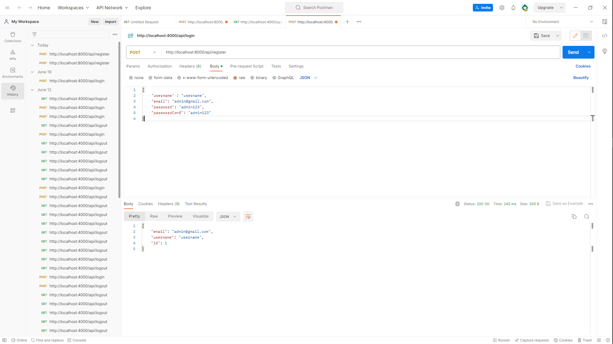

<p align="center">
    <a href="https://www.linkedin.com/in/zo-ambinintsoa">
        
    </a>
    <a href="mailto:ambinintsoa.business@gmail.com">
        
    </a>
</p>

# Product Manager Express API



<br>
<br>

This is an Express API for managing users, roles, products, and orders. It provides various endpoints for authentication, user management, role management, product management, and order handling.

# Installation

To run this API, you need to have Node.js and npm (Node Package Manager) installed on your system. Follow these steps to get started:

1. Clone the project repository or download the source code.

2. Open a terminal and navigate to the project directory.

3. Install the required dependencies by running the following command:

   ```shell
   npm install
    ```

    # Script Execution

This project provides several scripts that can be executed using the npm (Node Package Manager) command-line tool. The scripts are defined in the `package.json` file. Below are the available scripts:

- **start**: Starts the server by running the `index.ts` file using the `ts-node` TypeScript execution engine. This script is typically used in production environments.
- **seed:role**: Executes the `role.seeder.ts` file to seed the database with role data. This script can be used to initialize the roles in the system.
- **seed:product**: Executes the `product.seeder.ts` file to seed the database with product data. This script can be used to populate the product catalog.
- **seed:order**: Executes the `order.seeder.ts` file to seed the database with order data. This script can be used for testing or to create sample orders.

To execute a script, open a terminal or command prompt in the project's root directory and run the following command:

   ```shell
  npm run <script-name>
```


Replace `<script-name>` with the name of the script you want to execute. For example, to start the server, run:

   ```shell
  npm run start
```

# API Endpoints

This API provides the following endpoints for managing users, roles, products, and orders.

## Authentication

- `POST /api/register`: Register a new user.
- `POST /api/login`: Log in with existing user credentials.
- `POST /api/logout`: Log out the authenticated user.

## User Management

- `GET /api/user`: Get authenticated user information.
- `PUT /api/user/update`: Update user information.
- `PUT /api/user/update/password`: Update user password.

- `GET /api/users`: Get all users (requires 'User' permission).
- `GET /api/users/:id`: Get a specific user by ID (requires 'User' permission).
- `POST /api/users`: Create a new user (requires 'User' permission).
- `PUT /api/users/:id`: Update a user by ID (requires 'User' permission).
- `DELETE /api/users/:id`: Delete a user by ID (requires 'User' permission).

## Role Management

- `GET /api/role`: Get all roles (requires 'Role' permission).
- `GET /api/role/:id`: Get a specific role by ID (requires 'Role' permission).
- `POST /api/role`: Create a new role (requires 'Role' permission).
- `PUT /api/role/:id`: Update a role by ID (requires 'Role' permission).
- `DELETE /api/role/:id`: Delete a role by ID (requires 'Role' permission).

## Permission Management

- `GET /api/permission`: Get all permissions (requires 'Role' permission).

## Image Upload

- `POST /api/upload`: Upload an image file (requires authentication).
- `GET /api/uploads`: Get access to uploaded image files.

## Product Management

- `GET /api/product`: Get all products (requires 'Product' permission).
- `GET /api/product/:id`: Get a specific product by ID (requires 'Product' permission).
- `POST /api/product`: Create a new product (requires 'Product' permission).
- `PUT /api/product/:id`: Update a product by ID (requires 'Product' permission).
- `DELETE /api/product/:id`: Delete a product by ID (requires 'Product' permission).

## Order Management

- `GET /api/order`: Get all orders (requires authentication).
- `POST /api/export`: Export orders to a CSV file (requires authentication).
- `GET /api/chart`: Get order statistics as a chart (requires authentication).

Please refer to the API documentation or source code for more details on request payloads and responses.

---
Note: Some endpoints require specific permissions. Make sure to include the necessary permission when making requests.

# Middleware

This API uses middleware functions to handle authentication and permission checks for certain routes.

## Authentication Middleware

- `authMiddleware`: Middleware function that ensures the user is authenticated before accessing protected routes. Applied to routes that require authentication.

## Permission Middleware

- `permissionMiddleware(permission)`: Middleware function that checks if the authenticated user has the specified permission before accessing protected routes. Applied to routes that require specific permissions.

To use the middleware, simply import them from the respective files and apply them to the desired routes in your Express application.

Example usage:

```javascript
const express = require('express');
const app = express();
const { authMiddleware, permissionMiddleware } = require('./middleware/auth.middleware');

// Apply authentication middleware to all routes that require authentication
app.use(authMiddleware);

// Apply permission middleware to specific routes that require certain permissions
app.get('/api/users', permissionMiddleware('User'), (req, res) => {
  // Handle request
});

app.put('/api/users/:id', permissionMiddleware('User'), (req, res) => {
  // Handle request
});

// Other routes...

app.listen(3000, () => {
  console.log('Server is running on port 3000');
});
```
# Dependencies

This project relies on several external dependencies to run successfully. Below is a list of the main dependencies along with their versions:

- [bcryptjs](https://www.npmjs.com/package/bcryptjs) (v2.4.3): Library for hashing and comparing passwords.
- [cookie-parser](https://www.npmjs.com/package/cookie-parser) (v1.4.6): Middleware for parsing cookies in Express.
- [cors](https://www.npmjs.com/package/cors) (v2.8.5): Middleware for enabling Cross-Origin Resource Sharing (CORS) in Express.
- [dotenv](https://www.npmjs.com/package/dotenv) (v16.0.3): Module for loading environment variables from a .env file.
- [express](https://www.npmjs.com/package/express) (v4.18.2): Web framework for building the API.
- [express-validation](https://www.npmjs.com/package/express-validation) (v4.1.0): Middleware for validating request data in Express.
- [faker](https://www.npmjs.com/package/faker) (v5.5.3): Library for generating fake data.
- [json2csv](https://www.npmjs.com/package/json2csv) (v6.0.0-alpha.2): Library for converting JSON data to CSV format.
- [jsonwebtoken](https://www.npmjs.com/package/jsonwebtoken) (v9.0.0): Library for generating and verifying JSON Web Tokens (JWT) for authentication.
- [multer](https://www.npmjs.com/package/multer) (v1.4.5-lts.1): Middleware for handling file uploads in Express.
- [mysql2](https://www.npmjs.com/package/mysql2) (v2.3.3): MySQL client for Node.js.
- [nodemon](https://www.npmjs.com/package/nodemon) (v2.0.20): Development tool that automatically restarts the server upon file changes.
- [reflect-metadata](https://www.npmjs.com/package/reflect-metadata) (v0.1.13): Library for adding reflection metadata to TypeScript.
- [ts-node](https://www.npmjs.com/package/ts-node) (v10.9.1): TypeScript execution and REPL for Node.js.
- [typeorm](https://www.npmjs.com/package/typeorm) (v0.3.11): Object-Relational Mapping (ORM) library for TypeScript and JavaScript.
- [typescript](https://www.npmjs.com/package/typescript) (v4.9.4): TypeScript compiler for transpiling TypeScript code.

## Development Dependencies

The project also includes some development dependencies:

- [@types/bcryptjs](https://www.npmjs.com/package/@types/bcryptjs) (v2.4.2): TypeScript definitions for the bcryptjs library.
- [@types/cookie-parser](https://www.npmjs.com/package/@types/cookie-parser) (v1.4.3): TypeScript definitions for the cookie-parser library.
- [@types/cors](https://www.npmjs.com/package/@types/cors) (v2.8.13): TypeScript definitions for the cors library.
- [@types/express](https://www.npmjs.com/package/@types/express) (v4.17.16): TypeScript definitions for the express library.
- [@types/faker](https://www.npmjs.com/package/@types/faker) (v5.5.3): TypeScript definitions for the faker library.
- [@types/json2csv](https://www.npmjs.com/package/@types/json2csv) (v5.0.3): TypeScript definitions for the json2csv library.
- [@types/jsonwebtoken](https://www.npmjs.com/package/@types/jsonwebtoken) (v9.0.1): TypeScript definitions for the jsonwebtoken library.
- [@types/multer](https://www.npmjs.com/package/@types/multer) (v1.4.7): TypeScript definitions for the multer library.
- [@types/node](https://www.npmjs.com/package/@types/node) (v18.11.18): TypeScript definitions for Node.js.

You can install these dependencies using [npm](https://www.npmjs.com/) or any other package manager of your choice.

For example, to install the main dependencies, run the following command:

## License
This project is licensed under the MIT License. You can find the license information in the LICENSE file.

## Credits
The project was created by Zo ambinintsoa and is based on the canvas-sketch library developed by Matt DesLauriers.


<p align="center">
    <a href="https://www.linkedin.com/in/zo-ambinintsoa">
        
    </a>
    <a href="mailto:ambinintsoa.business@gmail.com">
        
    </a>
</p>